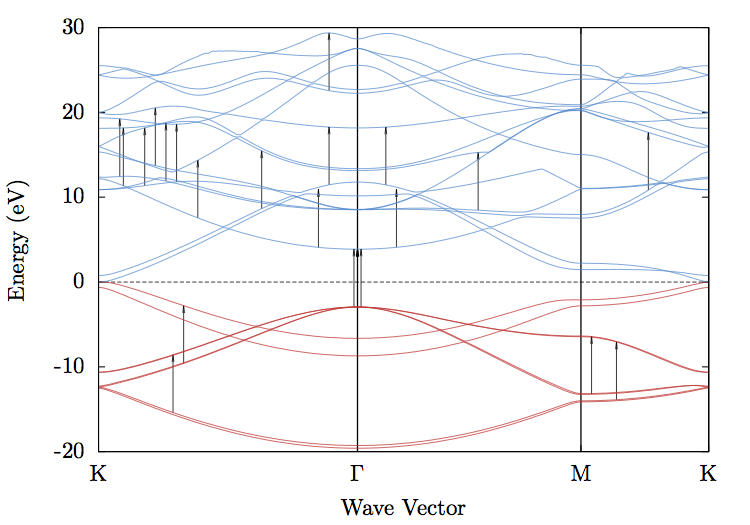

pynergy.py
==============

```sh
usage: python pynergy.py [-h] -i INPUT -v VALENCE -e ENERGY [-d DELTA]
```



This script calculates transition energies between energy bands using eigen-
energy files generated by ABINIT during a band structure calculation. This
script allows you to input a desired energy value and finds all the upward
transitions that can produce that value within a specified tolerance. You can see the full script instructions by running with the `-h` option:

```
python pynergy.py -h
```

If the input file is an unformatted EIG file produced by ABINIT, you can use
the adjoining 'eigenconvert.py' program that will automatically format it to a
plottable file:

```
python eigenconvert.py inputfile outputfile
```

You can then use that file to calculate the transitions. You can generate a sample output with 

```
python pynergy.py -i eigen_formatted -v 3 -e 6.81
```

This creates two files, `transitions.txt` and `gnuplotarrows`. The first is a text file that writes out the information about each transition, and the second is contains the lines necessary to produce arrows in Gnuplot. Simply `load` the file from within Gnuplot and `rep` to get your arrows.

A good gnuplot arrow style can be

```
set style arrow 3 head linetype 1 linecolor rgb "#000" linewidth 1.5 size screen 0.01,7,90
```
